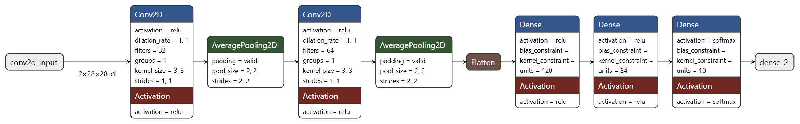
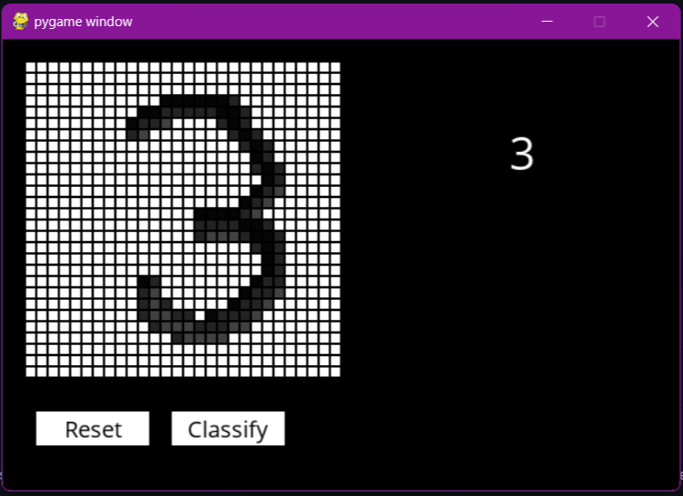

# Handwritten Digits Classification

This project employs a Convolutional Neural Network (CNN) to classify handwritten digits from the MNIST dataset. The model achieves an accuracy of over **99%** on the test set, demonstrating its exceptional performance for this image recognition task.

## Project Highlights

- **Dataset**: The MNIST dataset, consisting of grayscale images (28x28 pixels) of handwritten digits (0-9).
- **Model**:
  - Two convolutional layers with ReLU activation and average pooling for feature extraction.
  - Fully connected layers with ReLU activation for dense representations.
  - Softmax output layer for multiclass classification into 10 classes (digits 0-9).
- **Performance**: Achieved over **99% accuracy** on the test set due to effective preprocessing and architecture design.

## Interactive Application with Pygame

In addition to training the model, the project features an interactive program built using **Pygame**. This application allows users to:

1. **Draw a digit** on the canvas using their mouse.
2. **Click the "Classify" button** to send the drawn digit to the trained model.
3. Receive the **classified digit** displayed in real-time.

This intuitive interface makes it easy to test the model and interact with the digit classification process.

## Visuals

### CNN Model Architecture

### User Interface

